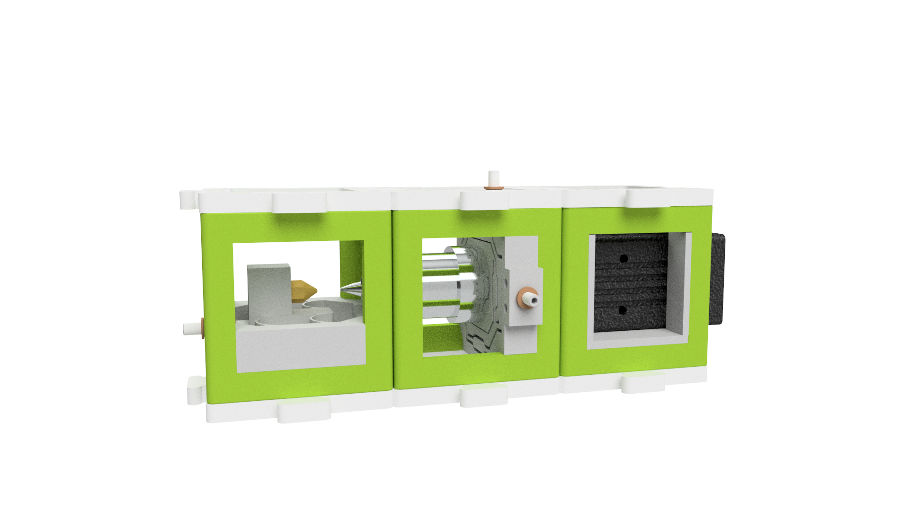
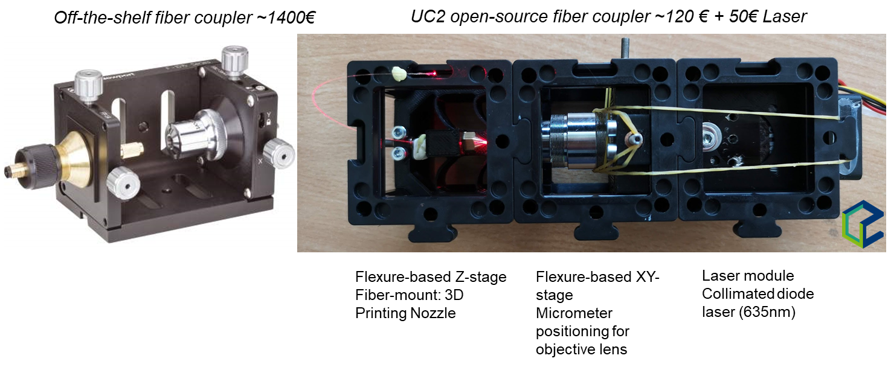
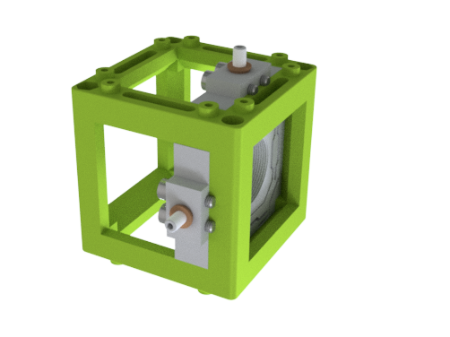
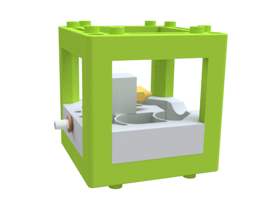

# openUC2 Open Fiber Coupler
---

This repository will help you to build and setup a fully functional XYZ fiber coupler for single- and multimode fibers for a tens of the price of a commercial system.

It hosts two flexurebearing-based cubes that can manipulate a coupling objective lens in XY and the fiber in Z. Both are pushed with Thorlabs micrometer screws.

Curious to see what this looks like? Keep scrolling!

The overall price is in the range 120-150€.

***Features:***
* XY flexure bearing (inspired from Rainer Heintzmann)
* Z flexure bearing
* micrometer-precision movement using micrometer screws
* Low-cost and open-source
* Fiber-coupling of single- and multimode fibers possible

# Table of Content
* **[Hardware](#-hardware)**
* **[Bill of materials](#-bill-of-materials)**
* **[Electronics](#-electronics)**
* **[Results](#-results)**

## In-Action

A comparison of a commercially available stage by edmund optics and the UC2 equivalent.

# Hardware

Below we describe how the device can be build and assembled in order to replicate the whole system as shown in the rendering above. All STLs are located in the folder [STL](./STL). All design files for Autodesk INVENTOR 2019 are located in the folder [INVENTOR](./INVENTOR).

## Bill of material

Below you will find all components necessary to build this device

### 3D printing files

All these files need to be printed. We used a Prusa i3 MK3 using PLA Prusament (Galaxy Black) at layer height 0.3 mm and infill 100%.

You need:
* 1x XY Translational Cube
* 1x Z Translational Cube
* 1x Laser Cube

### Additional parts
This is used in the current version of the setup

|  Type | Details  |  Price | Link  |
|---|---|---|---|
| 3D Printing Nozzle, 0.4mm, | Holds and centers the fiber  |  5 € | [Amazon](https://www.amazon.de/Stck-3D-Drucker-D%C3%BCse-Nozzle-0-4mm/dp/B0858644GN/ref=asc_df_B0858644GN/?tag=googshopde-21&linkCode=df0&hvadid=427629760683&hvpos=&hvnetw=g&hvrand=7848213166897452147&hvpone=&hvptwo=&hvqmt=&hvdev=c&hvdvcmdl=&hvlocint=&hvlocphy=9042960&hvtargid=pla-905298383747&psc=1&th=1&psc=1&tag=&ref=&adgrpid=99568786716&hvpone=&hvptwo=&hvadid=427629760683&hvpos=&hvnetw=g&hvrand=7848213166897452147&hvqmt=&hvdev=c&hvdvcmdl=&hvlocint=&hvlocphy=9042960&hvtargid=pla-905298383747)  |
| 3D Printing Nozzle, 0.4mm, | Holds and centers the fiber  |  5 € | [Amazon](https://www.amazon.de/Stck-3D-Drucker-D%C3%BCse-Nozzle-0-4mm/dp/B0858644GN/ref=asc_df_B0858644GN/?tag=googshopde-21&linkCode=df0&hvadid=427629760683&hvpos=&hvnetw=g&hvrand=7848213166897452147&hvpone=&hvptwo=&hvqmt=&hvdev=c&hvdvcmdl=&hvlocint=&hvlocphy=9042960&hvtargid=pla-905298383747&psc=1&th=1&psc=1&tag=&ref=&adgrpid=99568786716&hvpone=&hvptwo=&hvadid=427629760683&hvpos=&hvnetw=g&hvrand=7848213166897452147&hvqmt=&hvdev=c&hvdvcmdl=&hvlocint=&hvlocphy=9042960&hvtargid=pla-905298383747)  |
|Micrometer Screw | Pushes XYZ | 5 | [THORLABS](https://www.thorlabs.com/thorproduct.cfm?partnumber=F6SS088) |
|Micrometer Thread | Holds micrometer screw XYZ | 5 | [THORLABS](https://www.thorlabs.com/thorproduct.cfm?partnumber=F6SSN2P) |
| 10x finite corrected objective lens | focuses the beam | 30 | [Optics Pro](https://www.thorlabs.com/thorproduct.cfm?partnumber=F6SSN2P) |
| 4x M3 Screws  | Fix micrometer thread  | 0.30 | [Various]() |
### Design files
The original design files are in the [INVENTOR](./INVENTOR) folder.

### Assembly of the DEVICE

This will follow soon.

***1.*** *Assemble the XY translational stage*

* Add threading inserts
* Add micrometer screws
* Fix threading with M3 screws (it will scratch the thread!)
* Add the objective lens to the inserts
* Add the insert to the cube
* Done

***2.*** *Assemble the Z translational stage*

* Add 3d printing Nozzle
* Add threading inserts
* Add micrometer screws
* Fix threading with M3 screws (it will scratch the thread!)
* Add the insert to the cube
* Add fiber, fix it with "chewing gum" (**TODO:** Needs to be optimized..)
* Done

***3.*** *Coupling*

Align the focus with respect to the fiber opening

***3.*** *DONE! LOOK AT THE BEAUTY!*

## Get Involved

This project is open so that anyone can get involved. You don't even have to learn CAD designing or programming. Find ways you can contribute in  [CONTRIBUTING](https://github.com/openUC2/UC2-GIT/blob/master/CONTRIBUTING.md)

## License and Collaboration

This project is open-source and is released under the CERN open hardware license. Our aim is to make the kits commercially available.
We encourage everyone who is using our Toolbox to share their results and ideas, so that the Toolbox keeps improving. It should serve as a easy-to-use and easy-to-access general purpose building block solution for the area of STEAM education. All the design files are generally for free, but we would like to hear from you how is it going.

You're free to fork the project and enhance it. If you have any suggestions to improve it or add any additional functions make a pull-request or file an issue.

Please find the type of licenses [here](https://github.com/openUC2/UC2-GIT/blob/master/License.md)

REMARK: All files have been designed using Autodesk Inventor 2019 (EDUCATION)

## Collaborating
If you find this project useful, please like this repository, follow us on Twitter and cite the webpage! :-)
